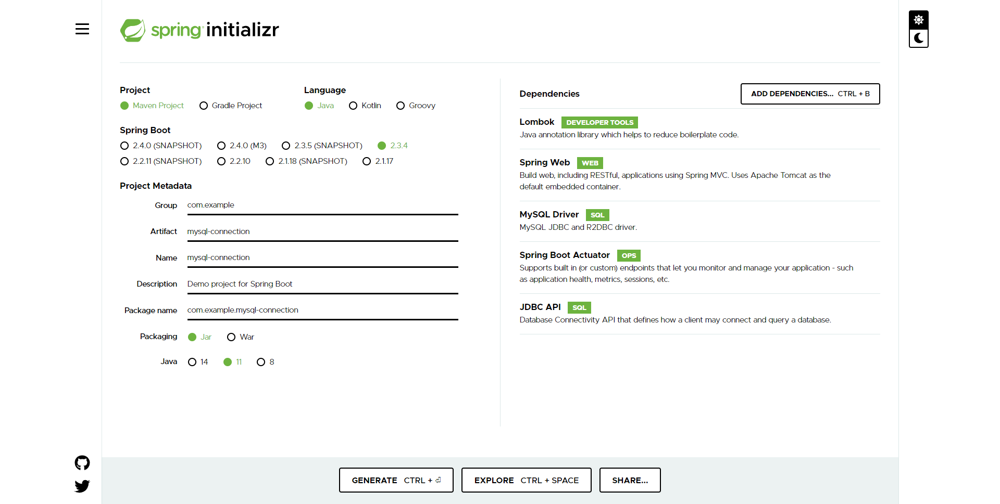

# MySQL Data Source
添加单一data source: MySQL

1. 在 https://start.spring.io/ 中添加如下dependencies:
 

2. 在 src/main/resources 中创建了 application.properties，指定MySQL数据源、username、password。
**注**: 这里使用的是MySQL安装时的救命数据库**world**。

3. 在 src/main/java/com.example.datasource/DatasourceApplication.java 中读取如下信息，并写入log：
* Data source string
* Data source connection string
* world.city 中的前十行数据

4. git remote set-url origin https://github.com/SpringFamily/mysql-connection.git
