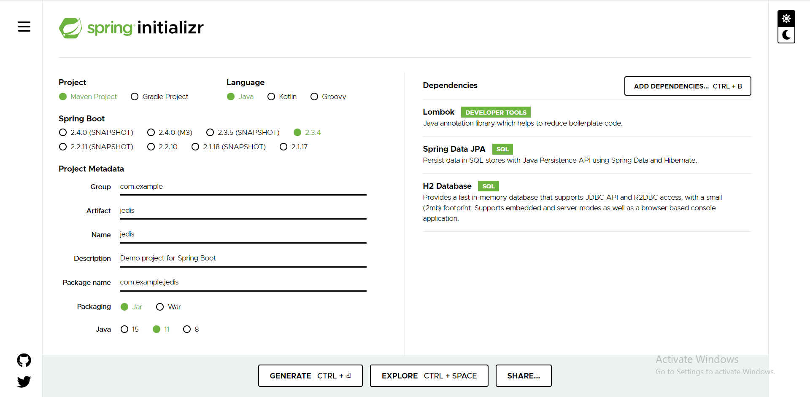
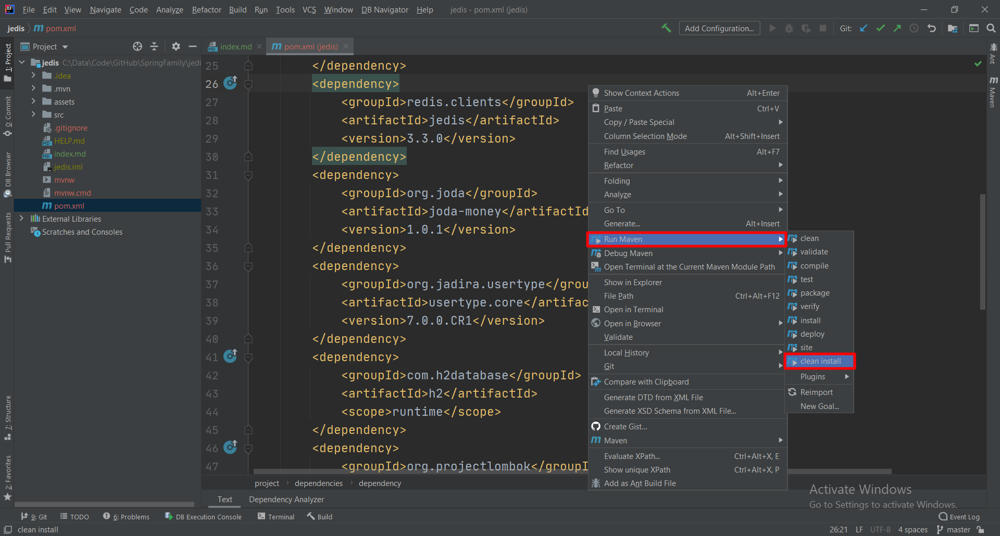
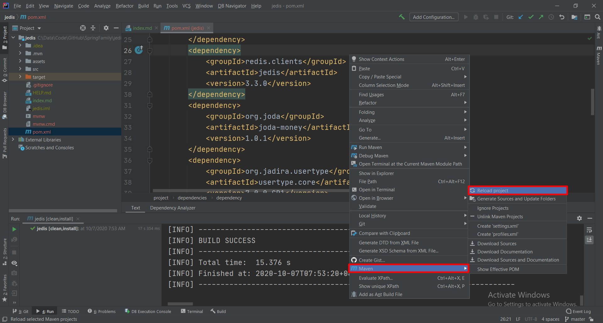

# Jedis

# 主要内容
> #### 在 Docker 上配置和运行 Redis
> #### Spring Start io
> #### Maven Configuration
> #### Project Configuration

# 在 Docker 上配置和运行 Redis
- 官方指引

        https://hub.docker.com/_/redis

- 获取镜像

        docker pull redis

- 启动 Redis
. 初次启动时执行如下命令：

        docker run --name redis -d -p 6379:6379 redis

-- 以后启动时执行如下命令：
        docker start redis

# Spring Start io

# Maven Configuration
1. pom.xml

        <dependency>
            <groupId>redis.clients</groupId>
            <artifactId>jedis</artifactId>
            <version>3.3.0</version>
        </dependency>
        <dependency>
            <groupId>org.joda</groupId>
            <artifactId>joda-money</artifactId>
            <version>1.0.1</version>
        </dependency>
        <dependency>
            <groupId>org.jadira.usertype</groupId>
            <artifactId>usertype.core</artifactId>
            <version>7.0.0.CR1</version>
        </dependency>

2. Maven Clean Install

3. Maven Reload Project

# Project Configuration
配置 application.properties, schema.sql, data.sql 三个文件
