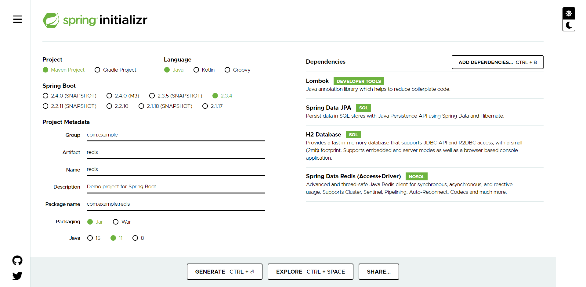
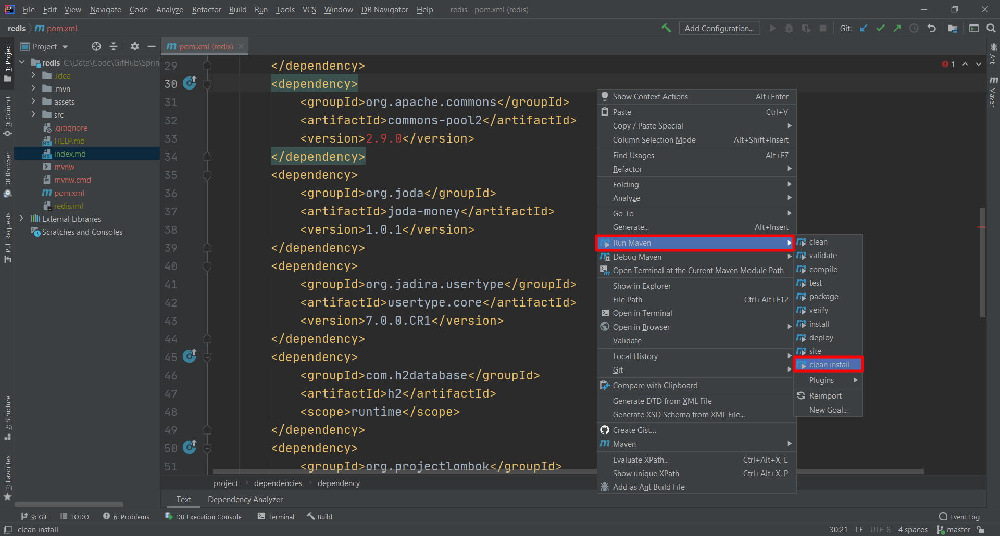
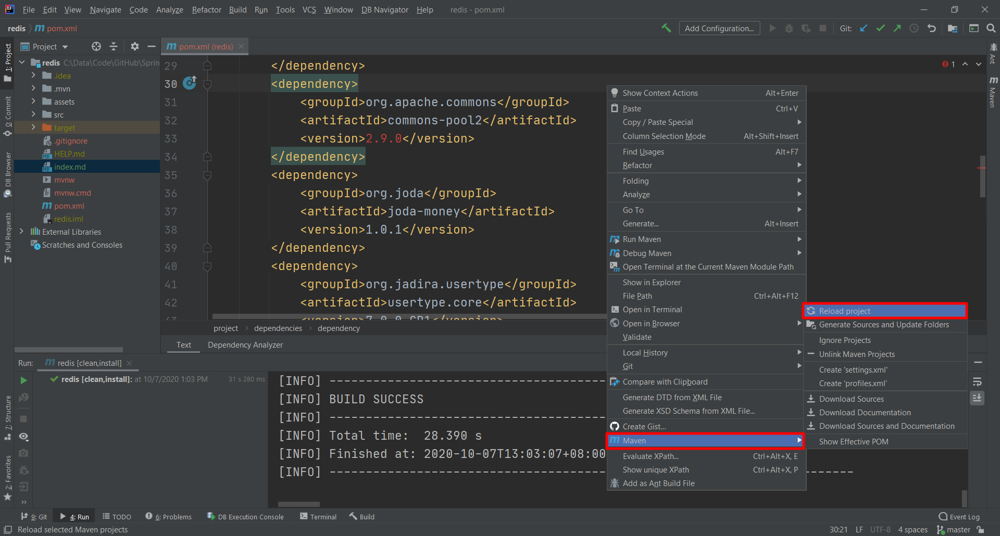

# Redis Lettuce
Spring Data Redis 默认使用的是 Lettuce，不再是 Jedis。

1. Spring Start io

2. pom.xml

        <dependency>
            <groupId>org.apache.commons</groupId>
            <artifactId>commons-pool2</artifactId>
            <version>2.9.0</version>
        </dependency>
        <dependency>
            <groupId>org.joda</groupId>
            <artifactId>joda-money</artifactId>
            <version>1.0.1</version>
        </dependency>
        <dependency>
            <groupId>org.jadira.usertype</groupId>
            <artifactId>usertype.core</artifactId>
            <version>7.0.0.CR1</version>
        </dependency>

3. Maven Clean Install

4. Maven Reload Project

5. application.properties, schema.sql, data.sql