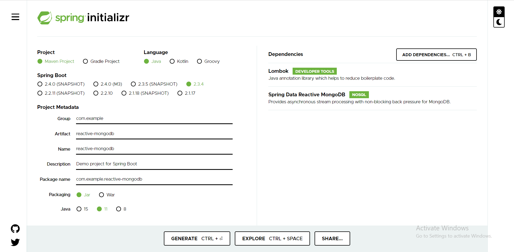

# Reactive Mongodb

1. Spring Start io

2. pom.xml

		<dependency>
			<groupId>org.joda</groupId>
			<artifactId>joda-money</artifactId>
			<version>1.0.1</version>
		</dependency>
		
3. application.properties