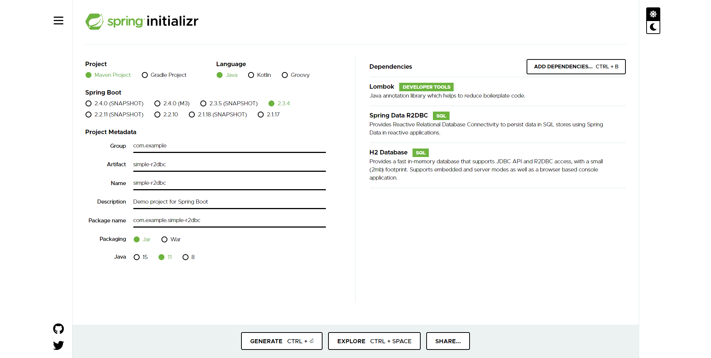

# simple R2DBC

1. Start Spring io

2. pom.xml
注意：平台已经自动添加了H2的R2DBC的依赖：

		<dependency>
			<groupId>io.r2dbc</groupId>
			<artifactId>r2dbc-h2</artifactId>
			<scope>runtime</scope>
		</dependency>

手动添加 org.joda 依赖：

		<dependency>
			<groupId>org.joda</groupId>
			<artifactId>joda-money</artifactId>
			<version>1.0.1</version>
		</dependency>
		
3. schema.sql, data.sql