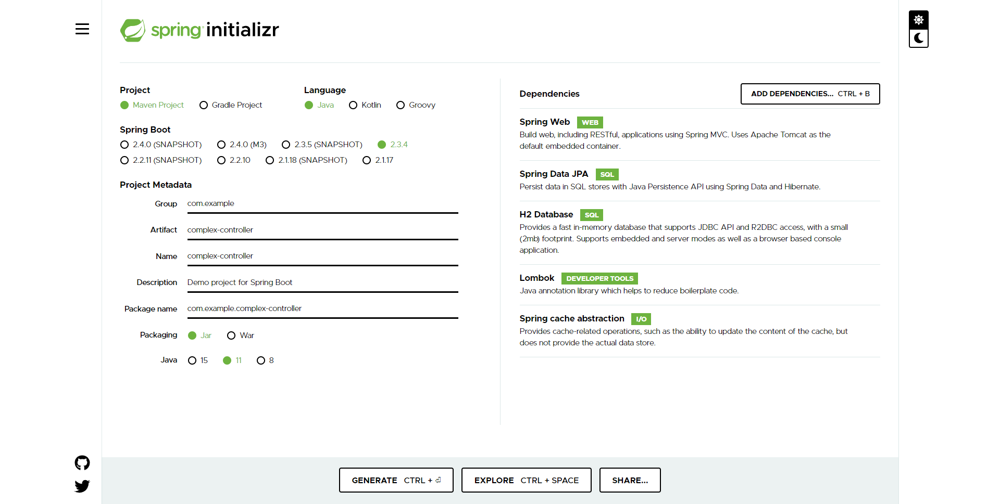
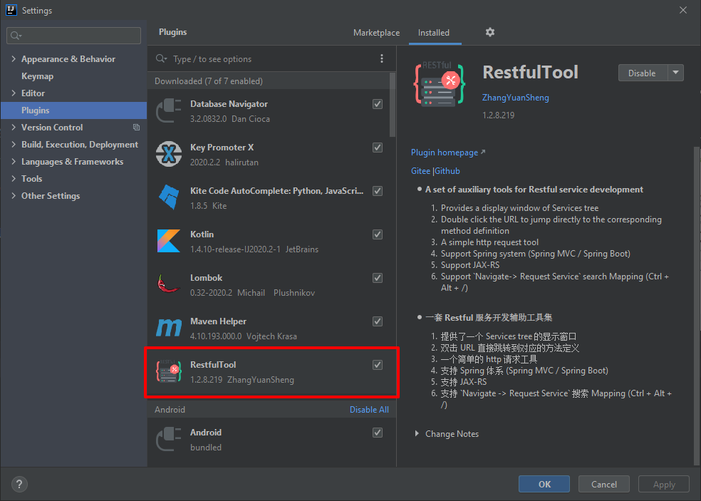
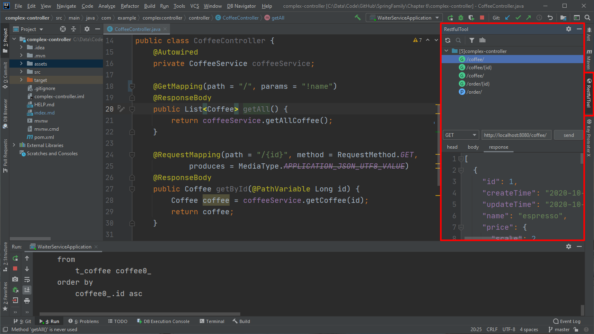
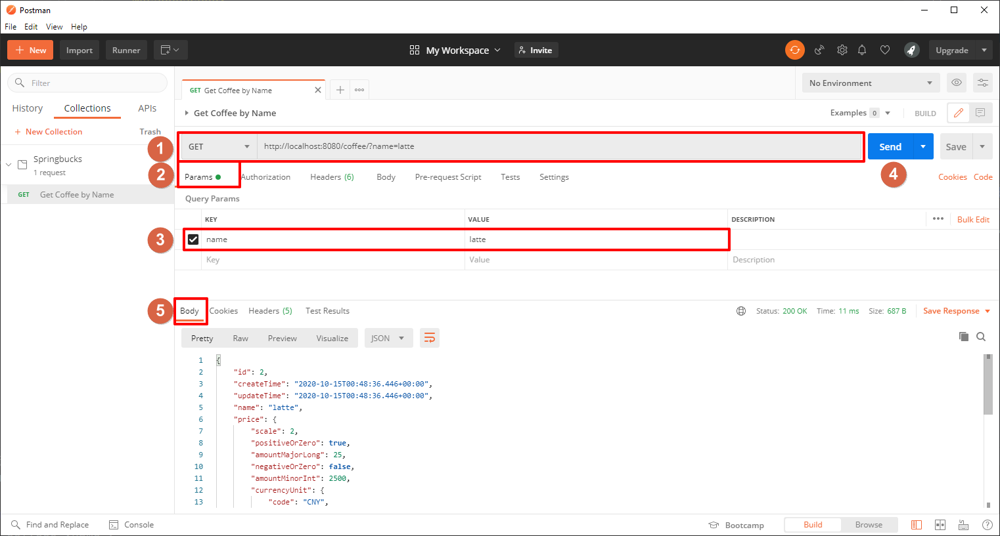
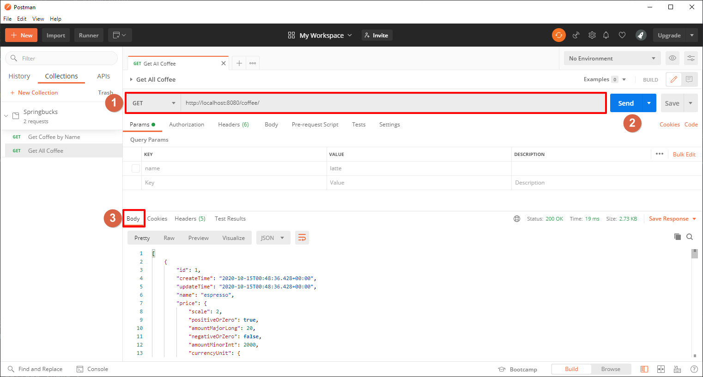
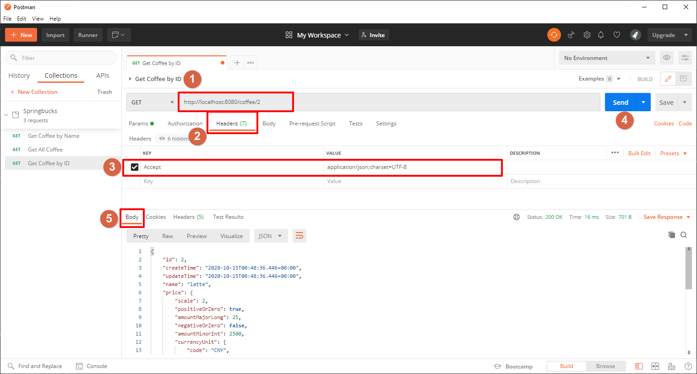
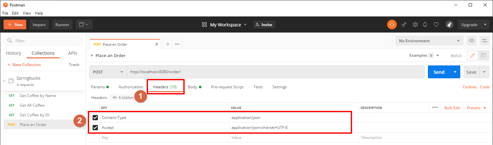
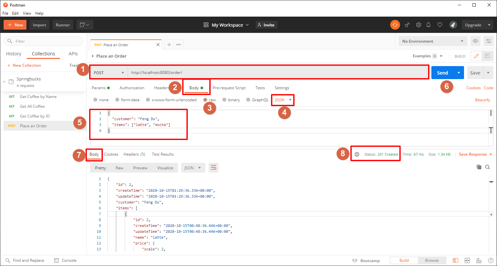

# Complex Controller
这是一个稍微复杂些的 Controller 的例子，演示了更多功能。

# Project Setup
1. Spring Start io

2. pom.xml

		<dependency>
			<groupId>org.joda</groupId>
			<artifactId>joda-money</artifactId>
			<version>1.0.1</version>
		</dependency>
		<dependency>
			<groupId>org.jadira.usertype</groupId>
			<artifactId>usertype.core</artifactId>
			<version>7.0.0.CR1</version>
		</dependency>
		
3. application.properties, schema.sql, data.sql

# Tool
如下工具可以帮助调试code，推荐使用 Postman。
- RestfulTool
   IDEA的一个plugin，可以在IDEA中发送简单的request，进行调试，但是功能有限。可以在 File > Settings > Plugins 中可以安装 RestfulTool 插件，也可以使用其它类似的 plugin，比如 Show REST Services.
  
  
- crul command line
- Postman (**推荐**)
   一个带有界面、功能强大的tool。文章中会大量使用 Postman 的截图进行调试和解释。

# Knowledge
## @RequestMapping 同时适用于 class 和 method
class 上的path，是所有 method 的prefix

## @RequestMapping(method = ) = @GetMapping

## @RestController = @Controller + @ResponseBody

##  @ResponseStatus(HttpStatus.CREATED)

## Get Coffee by Name
**Get Request**: http://localhost:8080/coffee/?name=latte

    @GetMapping(path = "/", params = "name")
    @ResponseBody
    public Coffee getByName(String name) {
        return coffeeService.getCoffee(name);
    }

## Get All Coffee
**Get Request**: http://localhost:8080/coffee/
@ResponseBody 代表结果将在 Response Body 中传回来。

    @GetMapping(path = "/", params = "!name")
    @ResponseBody
    public List<Coffee> getAll() {
        return coffeeService.getAllCoffee();
    }

## Get Coffee by ID
** Get Request**: http://localhost:8080/coffee/2
produces 对应**Request Header**: Accept = application/json;charset=UTF-8
@PathVariable Long id 代表 id 从 Request Path 中获取。

    @RequestMapping(path = "/{id}", method = RequestMethod.GET,
            produces = MediaType.APPLICATION_JSON_UTF8_VALUE)
    @ResponseBody
    public Coffee getById(@PathVariable Long id) {
        Coffee coffee = coffeeService.getCoffee(id);
        return coffee;
    }

## Place an Order
** Post Request**: http://localhost:8080/order/
consumes 对应**Request Header**: Content-Type = application/json
produces 对应**Request Header**: Accept = application/json;charset=UTF-8
@RequestBody NewOrderRequest newOrder 代表 order信息 从 Request Body 中获取。
@ResponseStatus(HttpStatus.CREATED) 表示正确返回的状态为 201，不再是默认的 200。
注意：CoffeeOrderController 上的 @RestController = @Controller + @ResponseBody，所以此 method 没有添加 @ResponseBody 注解。
 
    @PostMapping(path = "/", consumes = MediaType.APPLICATION_JSON_VALUE,
            produces = MediaType.APPLICATION_JSON_UTF8_VALUE)
    @ResponseStatus(HttpStatus.CREATED)
    public CoffeeOrder create(@RequestBody NewOrderRequest newOrder) {
        log.info("Receive new order: {}", newOrder);
        Coffee[] coffeeList = coffeeService.getCoffeeByName(newOrder.getItems())
                .toArray(new Coffee[]{});
        return orderService.createOrder(newOrder.getCustomer(), coffeeList);
    }
    

