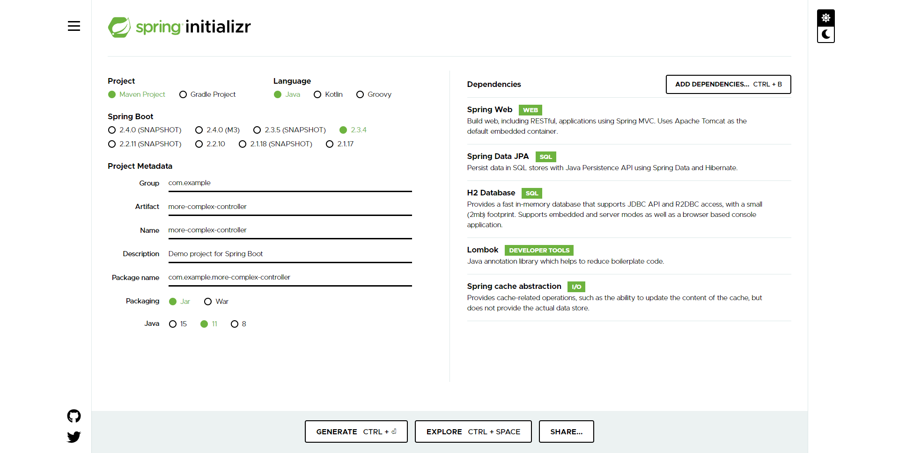

# More Complex Controller

1. Spring Start io

2. pom.xml

		<dependency>
			<groupId>org.joda</groupId>
			<artifactId>joda-money</artifactId>
			<version>1.0.1</version>
		</dependency>
		<dependency>
			<groupId>org.jadira.usertype</groupId>
			<artifactId>usertype.core</artifactId>
			<version>7.0.0.CR1</version>
		</dependency>
		<dependency>
			<groupId>org.apache.commons</groupId>
			<artifactId>commons-lang3</artifactId>
			<version>3.11</version>
		</dependency>
		
