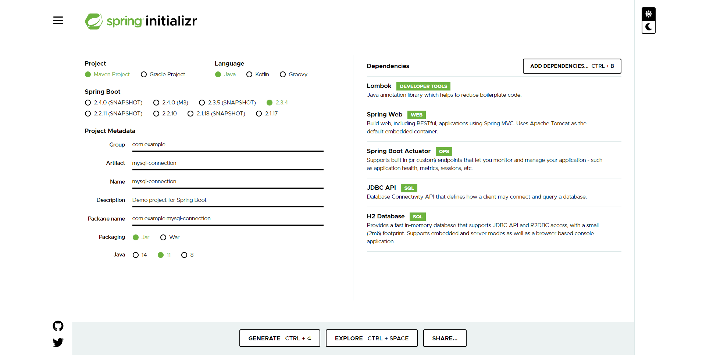

# [Home](https://du-feng.github.io)

# H2 Data Source
添加单一 data source: H2

1. 在 https://start.spring.io/ 中添加如下dependencies:

2. 在 src/main/resources 中创建 application.properties，指定H2数据源。
3. 在 src/main/resources 中创建如下两个文件：
* **schema.sql**: 在H2中创建一个table
* **data.sql**: 向H2的table中添加两行数据
4. 在 src/main/java/com.example.datasource/DatasourceApplication.java 中读取如下信息，并写入log：
* Data source string
* Data source connection string
* H2 table 中的两行数据
