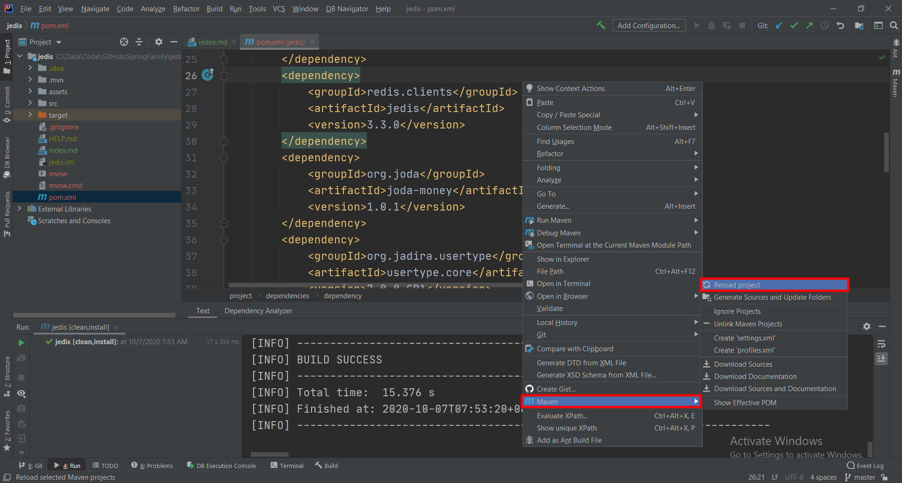

# Jedis

1. Docker
官方指引

        https://hub.docker.com/_/redis

获取镜像

        docker pull redis

启动 Redis

        docker run --name redis -d -p 6379:6379 redis

2. Spring Start io

3. pom.xml

        <dependency>
            <groupId>redis.clients</groupId>
            <artifactId>jedis</artifactId>
            <version>3.3.0</version>
        </dependency>
        <dependency>
            <groupId>org.joda</groupId>
            <artifactId>joda-money</artifactId>
            <version>1.0.1</version>
        </dependency>
        <dependency>
            <groupId>org.jadira.usertype</groupId>
            <artifactId>usertype.core</artifactId>
            <version>7.0.0.CR1</version>
        </dependency>

4. Maven Clean Install

5. Maven Reload Project

6. 最后配置 application.properties, schema.sql, data.sql 三个文件
