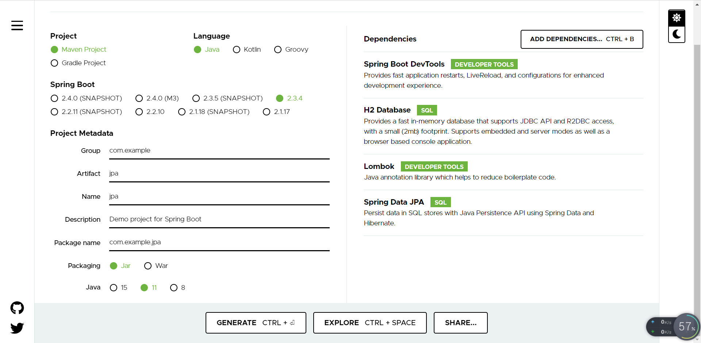
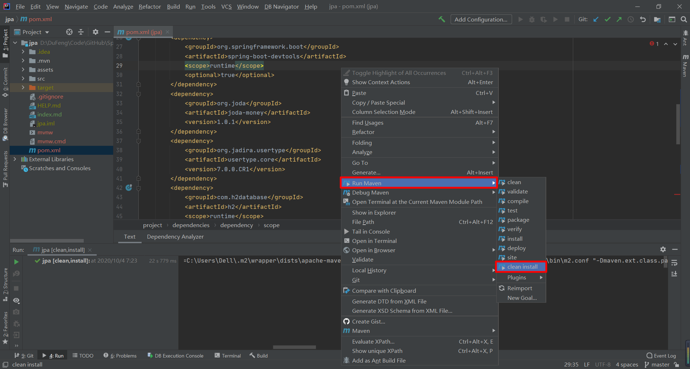
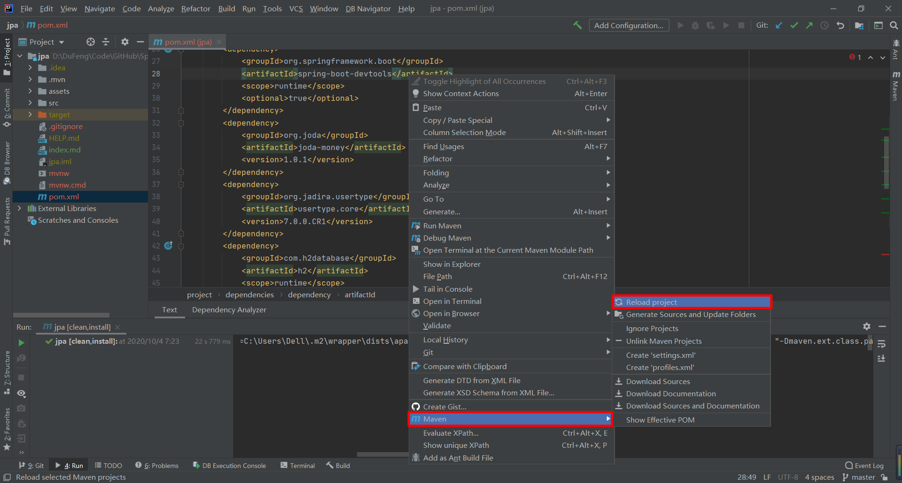

#JPA Demo
1. Spring Start

2. 手动添加如下 dependency

        <dependency>
            <groupId>org.joda</groupId>
            <artifactId>joda-money</artifactId>
            <version>1.0.1</version>
        </dependency>
        <dependency>
            <groupId>org.jadira.usertype</groupId>
            <artifactId>usertype.core</artifactId>
            <version>7.0.0.CR1</version>
        </dependency>

3. Maven clean and install
mvn clean install -U

4. Maven Reload Project
