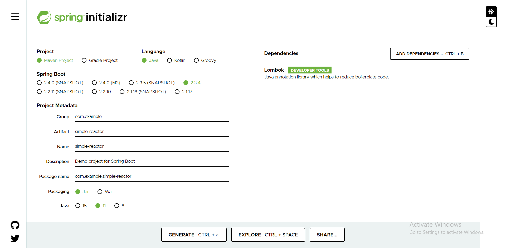

# Simple Project Reactor
这是第一个小程序，目的是熟悉 Project Reactor

# Spring Start io

# pom.xml

        <!-- https://mvnrepository.com/artifact/io.projectreactor/reactor-core -->
        <dependency>
            <groupId>io.projectreactor</groupId>
            <artifactId>reactor-core</artifactId>
            <version>3.3.10.RELEASE</version>
        </dependency>